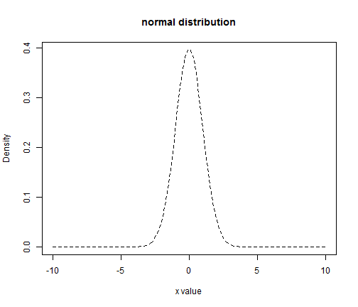

## A normal distribution plot ##


```r
x <- seq(-10, 10, length=100)
hx <- dnorm(x)
plot(x, hx, type="l", lty=2, xlab="x value",
                     ylab="Density", main="normal distribution")
```



```r
lines(x, dt(x, 1),lwd=2, col=colors[1])
```

```
## Error: object of type 'closure' is not subsettable
```


---


<iframe src="https://huangshengb.shinyapps.io/project_shiny/"></iframe>

--- &radio

## Quiz

Which one of these slidify slides do you like the most?

1. I don't like any of these slides 
2. The normal distribution plot
3. T distribution
4. _I can not tell. All is interesting._

*** .hint
This is a hint

*** .explanation
This is an explanation


